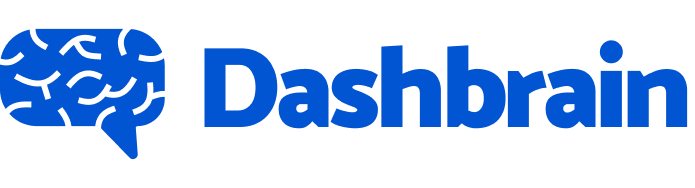
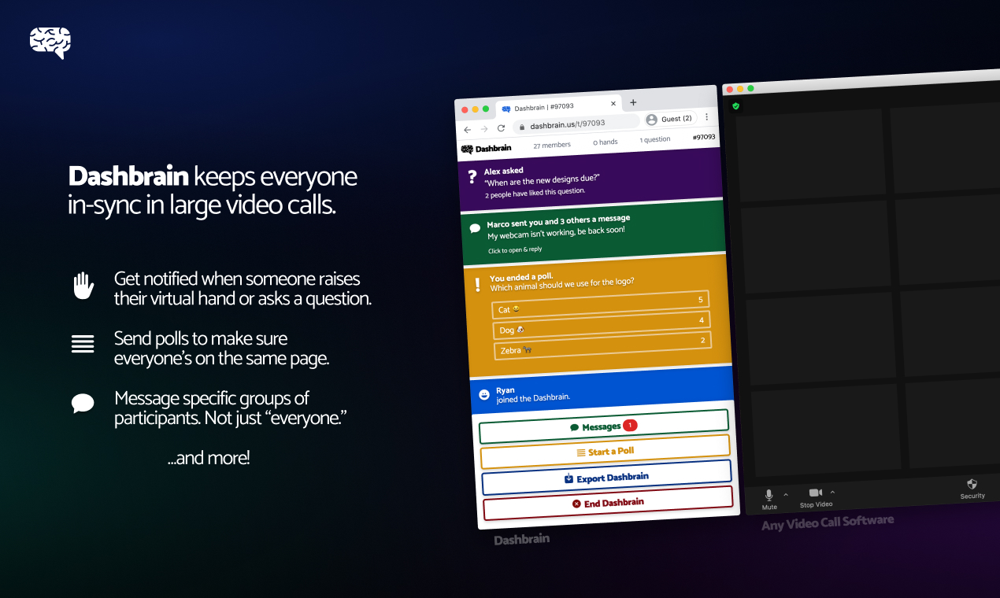
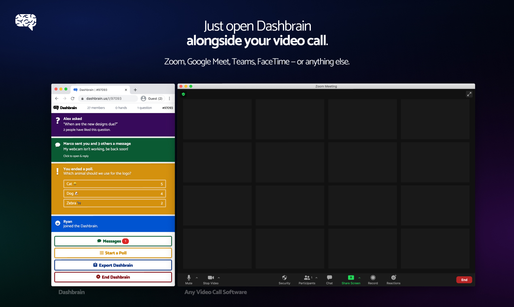
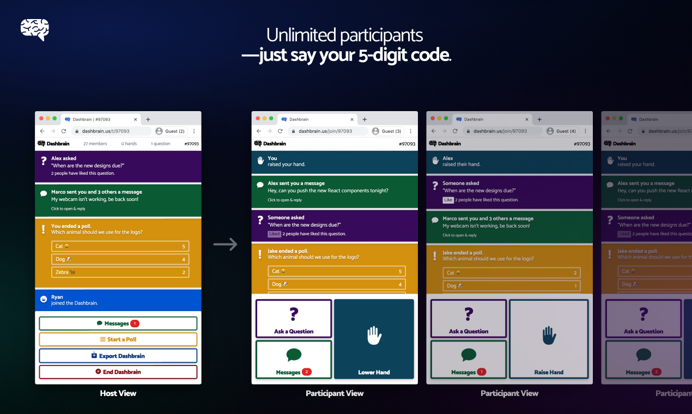
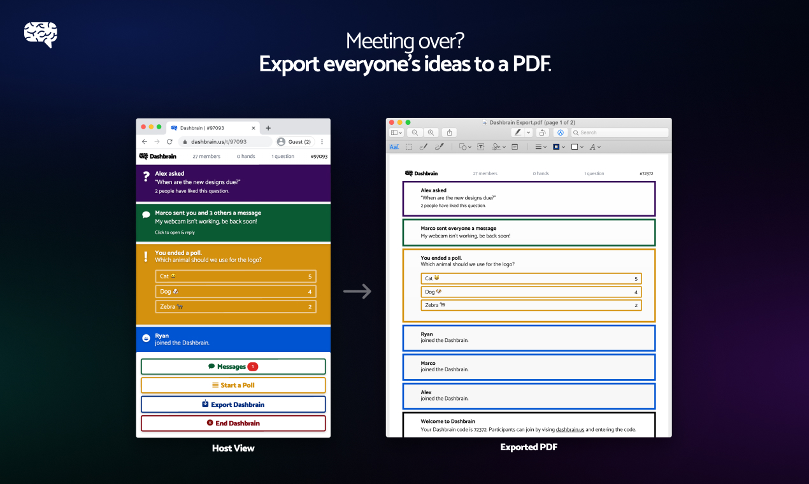
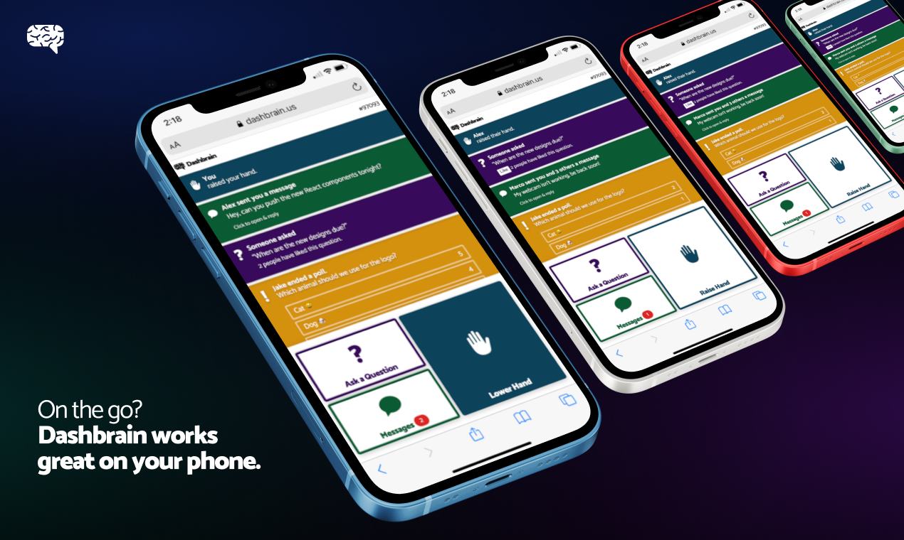
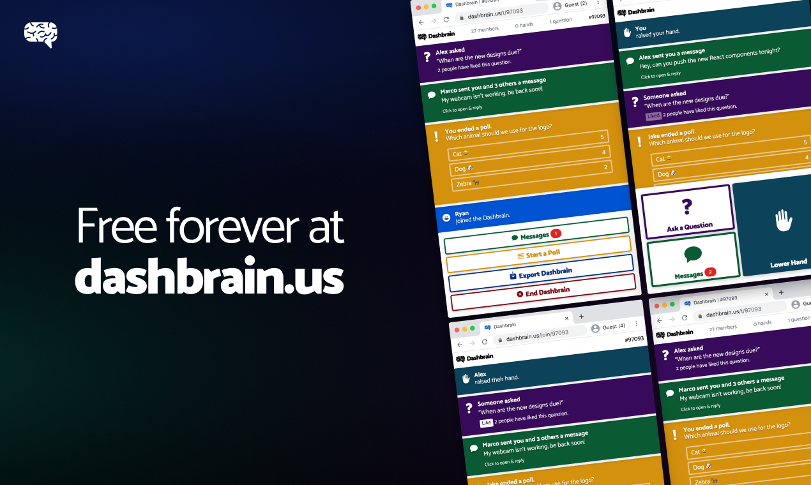

# Dashbrain

_Smarter chat for any video call, in just two clicks._

## Features

Dashbrain makes your video meetings smarter — Zoom, Google Meets, Teams, FaceTime, custom WebRTC, you name it.

1.  You open dashbrain.us next to your video call and click the "New Dashbrain" button.
2.  You tell your participants 5-digit code.
3.  They go to dashbrain.us next to their video calls and enter the code.

And now, you chat inside Dashbrain, where you can...

✋ _Get clear, obvious notifications when someone raises their hand_

When a participant clicks the Raise Hand button in Dashbrain, the host will immediately notice the notification at the top of their screen. No more scanning lists of participants' names to find one tiny icon.

💯 _Send polls in two clicks_

Send polls and instantly receive feedback from participants. Hosts can choose whether participants see results immediately (like Twitter) or only after they choose to release the results.

❓ _Asking questions just became fun_

Participants can ask public questions and receive "likes" from other participants. As with raised hands, hosts will notice right away when they get a question. No more awkwardly asking "any questions?" the end of your meeting.

💬 _Custom group chats_

In most video call software, you get a choice: message one person, or message "everyone." With Dashbrain, you can message any custom group of people — one, two, three, four, whatever you want. (Of course, you can also choose to message "everyone" as well.)

✍️ _Formatting: bold, italics, code, and URLs_

Dashbrain supports Markdown syntax for making text bold (like this: **bold**), italic (like this: _italics_), and monospace (like this: `code`), as well as automatically making URLs become clickable links.

🖨 _Export to PDF_

With everyone's great ideas flowing in Dashbrain, you might want to save the contents of your chat after the meeting ends. In one click, you can export to a PDF. And don't worry, we filter out your private messages.

## Screenshots

<p>
  
  
  
  
  
  
</p>

## Running Dashbrain locally

Before running Dashbrain, fill in the following configuration files:

- `frontend/config/config.json`: Configuration for the frontend, including an app name, Firebase configuration, and options for room IDs.
- `server/firebase-service-key.json`: A Firebase admin service key.

Then, start Dashbrain with:

```sh
npm run dev
```

## Project outline

Dashbrain is a [Next.js](https://nextjs.org) project. The directory structure is as follows:

- `frontend`: Frontend-related libraries and components.
  - `components`: Shared components.
  - `lib`: Client-side libraries.
- `pages`: Components for each page and API route in standard Next.js fashion.
- `public`: Static assets.
- `server`: Server-side code.
  - `lib`: Server-side libraries.
- `styles`: Global styles. Note, most styling is handled with [TailwindCSS](https://tailwindcss.com).

## Get Dashbrain

🧠 Try Dashbrain at https://dashbrain.us.

🎓 The Teacher Edition is available [here](https://school.dashbrain.us).

😸 Check it out on [Product Hunt](https://www.producthunt.com/posts/dashbrain).
